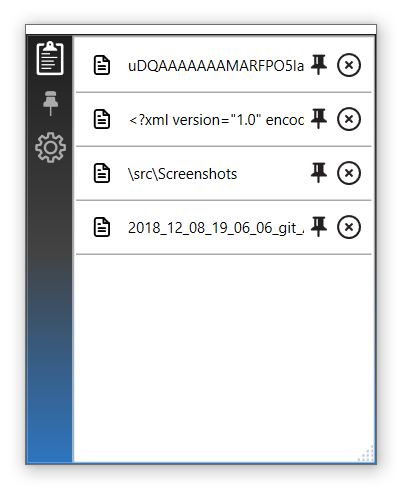

# Clipboard Manager 

Clipboard Manager is a nice clipboard manager that is written in WPF. It uses Windows API in the background for certain operations. It supports all recent Windows platforms. Screenshot:

You can download the application from [here](https://github.com/BuraChuhadar/ClipboardManager/releases/tag/1.0.4).
